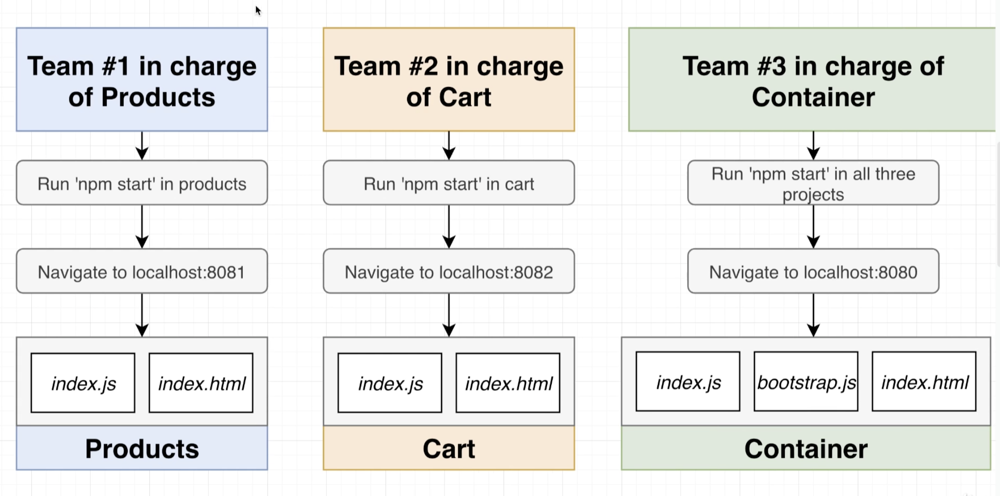

# Microfrontend Shop App

A demo microfrontend shop app built with HTML, CSS, JavaScript, and Webpack Module Federation using Run-Time Integration.

### Install

Run the following command in both the products, cart and container folders:

    $ npm install

### Run

Run the following command in both the products, cart and container folders:

    $ npm start

Products: http://localhost:8081/

Cart: http://localhost:8082/

Container: http://localhost:8080/

## Microfrontends

### What are microfrontends?

- Divide a monolithic app into multiple, smaller apps
- Each smaller app is responsible for a distinct feature of the product

### Why use them?

- Multiple engineering teams can work in isolation
- Each smaller app is easier to understand and make changes to

### Requirement

Must be able to develop each sub-project in isolation, and run each sub-project in the context of a container.

## Integrations

### Build-Time Integration

AKA compile-time integration. Integration before Container gets loaded in the browser, it gets access to ProductsList source code.

1. Engineering team develops ProductList
2. Time to deploy!
3. Publish ProductsList as an NPM package -> NPM Registry
4. Team in charge of Container install ProductsList as a dependency (npm install)
5. Container team builds their app
6. Output bundle that includes all the code for ProductsList

PROS:

- Easy to setup and understand

CONS:

- Container has to be re-deployed every time ProductsList is updated
- Tempting to tightly couple the Container + ProductsList

### Run-Time Integrations

AKA client-side integration. Integration after Container gets loaded in the browser, it gets access to ProductsList source code.

1. Engineering team develops ProductsList
2. Time to deploy!
3. ProductsList code deployed at https://my-app.com/productslist.js
4. User navigates to my-app.com, Container app is loaded
5. Container app fetches productslists.js and executes it

PROS:

- ProductsList can be deployed independently at any time
- Different versions of ProductsList can be deployed and Container can decide which one to use

CONS:

- Tooling + setup is far more complicated

NOTE: this project uses this type of integration with the help of Webpack Module Federation

This integration is hardest to setup and understand, but is most flexible and performant solution around right now.

#### Module Federation

Outputs a set of files in products folder, which allow for integration:

- remoteEntry.js -> contains a list of files that are available from this project + directions on how to load them
- src_index_js.js -> version of src/index.js that can be safely loaded into the browser
- faker.js -> version of faker code that can be safely loaded into the browser

Container project webpack:

- index.js -> for making sure that webpack knows to get some additional javascript (from products project)
- main.js -> contains contents of index.js
- bootstrap.js -> contains bootstrap.js. webpack knows it has to fetch something from products before running this file

NOTE: Products and Cart index.html are only used during development. Container is used during development and production.

### Server Integration

While sending down JS to load up Container, a server decides on whether or not to include ProductsList source.
